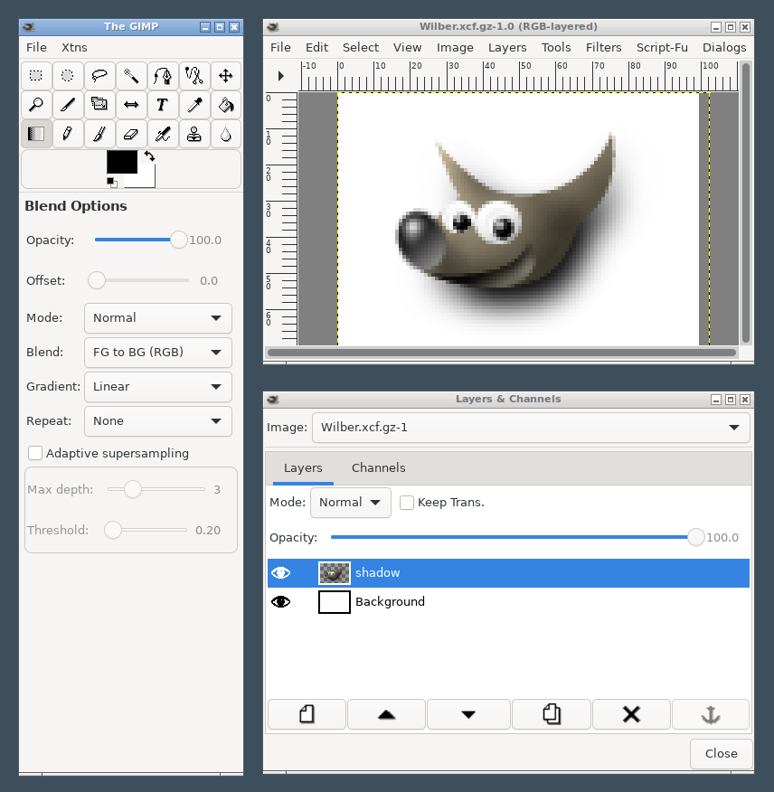

# GIMP42

GIMP42 is a fork and modernization of **GIMP 1.0.4**, the GNU Image
Manipulation Program from 1998. It keeps the original program (its tools,
dialogs, plug-ins and Script-Fu) but moves it onto today's platform:

- **GTK 4**, GLib 2, cairo and Pango instead of GTK 1.2 and X11
- **Meson** instead of autotools
- **Native on Windows**, as well as Linux and macOS



## What's new compared to GIMP 1.0

- The active tool's options are in the toolbox, below the tools (they
  were in a separate Tool Options dialog)
- Runs natively on Windows: plug-ins talk to the program over pipes, and
  the installation can be moved anywhere
- First run sets up your GIMP folder automatically
- A menu bar on image windows (the right-click menu is still there)
- Copy and paste images to and from other programs through the system
  clipboard
- Drag image files onto a window to open them, and File > Open Recent
- The mouse wheel scrolls, and Ctrl + wheel zooms
- Text is rendered with Pango, using any font on the system
- More file formats: WebP (with animations), HEIF/HEIC and AVIF, JPEG XL,
  Windows icons and cursors, QOI, and whatever else GDK-Pixbuf reads,
  such as SVG
- File > Print uses the system's print dialog, with an Image Settings
  tab to size and place the image on the page, and File > Page Setup;
  the original PostScript, PCL and ESC/P2 drivers are still there
- File > Acquire > Scanner scans through SANE on Linux and macOS and
  through Windows' own scanner dialog (WIA) on Windows
- Cancelling a file format's options when saving no longer marks the
  image as saved

## Building

You need GTK 4 (4.10 or later), Meson and Ninja, and optionally libjpeg,
libpng, libtiff, libwebp, libheif, libjxl, zlib and libbz2 for the file
format plug-ins and SANE (sane-backends) for scanning on Linux and macOS.
A plug-in whose library is missing is simply not built.

```sh
meson setup builddir --prefix="$PWD/_install"
meson compile -C builddir
meson install -C builddir
./_install/bin/gimp42
```

On Windows, use an [MSYS2](https://www.msys2.org) UCRT64 or MINGW64 shell
and install the `gtk4`, `meson`, `ninja`, `pkgconf`, `libjpeg-turbo`,
`libpng`, `libtiff`, `libwebp`, `libheif`, `libjxl`, `zlib` and `bzip2`
packages first.

GitHub Actions build every push on Linux, macOS and Windows; the Windows
job also makes a portable bundle and an installer.

## Documentation

- [docs/PORTING.md](docs/PORTING.md) describes how the GTK 1 code was
  moved to GTK 4, and the conventions ported code follows.
- `README` is the original GIMP 1.0 readme.

## License

GPL-2.0-or-later, as the original GIMP; see [COPYING](COPYING).
The GIMP was written by Spencer Kimball and Peter Mattis, with many
contributors; see [AUTHORS](AUTHORS).
